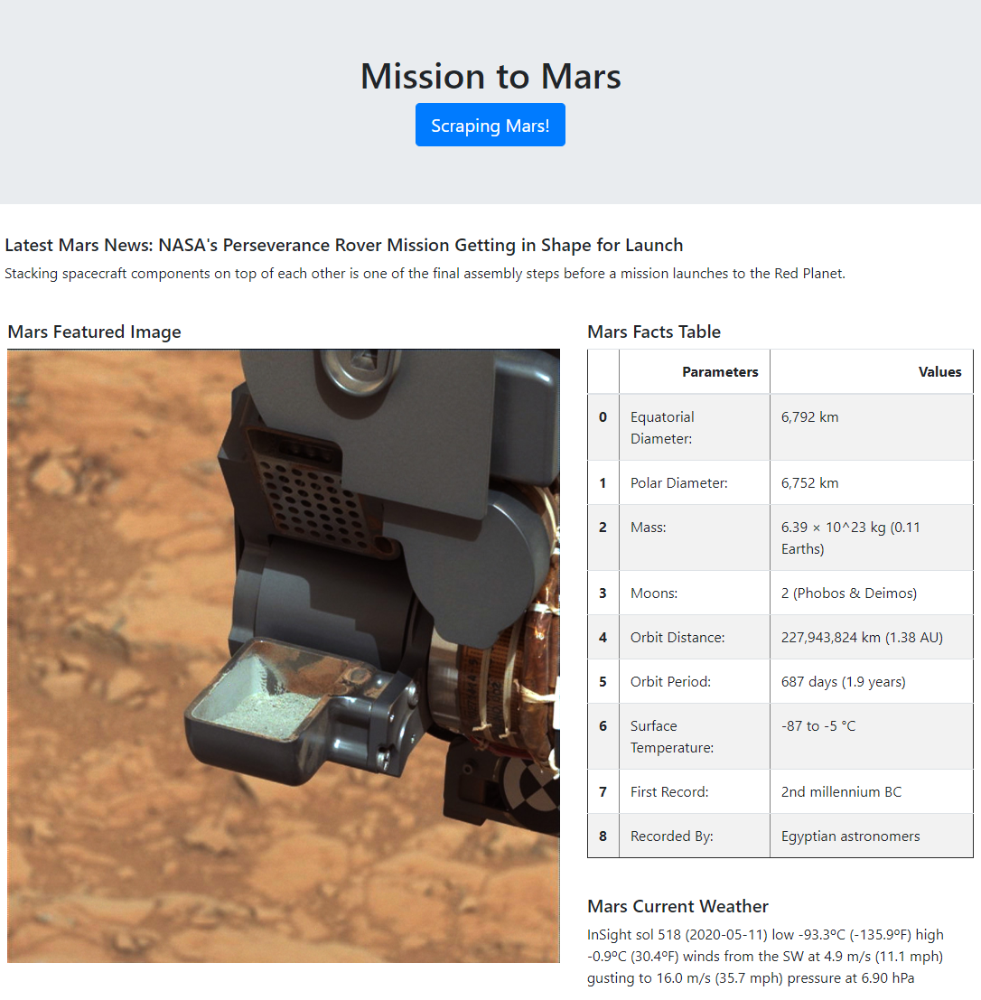
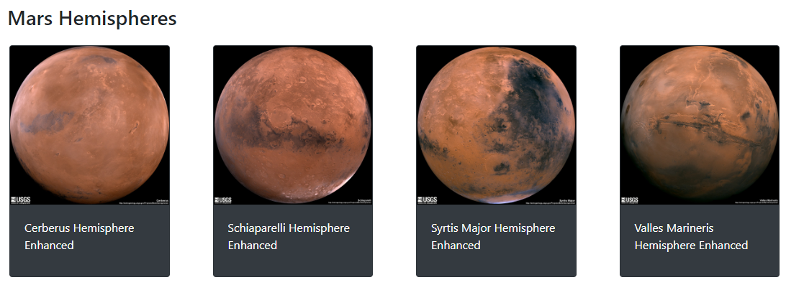

# Mission to Mars

In this project we built a web application that scraped several websites for data related to the Mission to Mars and displayed the information into a HTML page

### Data sources
* NASA Mars News (https://mars.nasa.gov/news/)
* JPL Mars Space Images - Featured Image (https://www.jpl.nasa.gov/spaceimages//spaceimages/images/largesize/PIA20464_hires.jpg)
* Mars Weather Twit (https://twitter.com/marswxreport?lang=en)
* Mars Facts (https://space-facts.com/mars/)
* Mars Hemisphere Images (https://astrogeology.usgs.gov/search/results?q=hemisphere+enhanced&k1=target&v1=Mars)

### Screenshots from the final application

